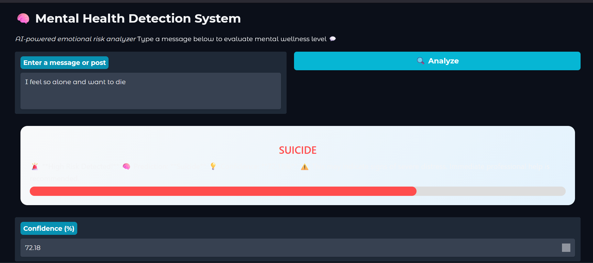

# 🧠 Mental Health & Suicide Detection Using Social Media Posts

[](https://www.python.org/)
[](https://www.tensorflow.org/)
[](https://colab.research.google.com/)
[](LICENSE)
[](/)

> An AI-powered system for early detection of mental health risks and suicidal intent using Natural Language Processing and Deep Learning

---

## 📌 Overview

In today's digital landscape, individuals increasingly express emotional distress, depression, and suicidal thoughts through social media platforms. However, manually identifying these critical warning signs at scale is virtually impossible.

This project presents an **end-to-end intelligent system** that automatically detects suicidal tendencies and mental health risks from textual content using advanced NLP, Machine Learning, and Deep Learning techniques.  
All experiments, training, and evaluation were conducted using **Google Colab** for scalable computing and GPU acceleration.

**Key Achievement:** 96.57% accuracy with real-time prediction capabilities for immediate intervention support.

---

## 🏗️ Development Environment

- **Platform:** Google Colab  
- **Language:** Python 3.8+  
- **Frameworks:** TensorFlow 2.x, Keras  
- **Libraries:** NLTK, Scikit-learn, Pandas, NumPy, TextBlob  

---

## 🎯 Objectives

- ✅ Detect suicidal and high-risk mental health language patterns  
- ✅ Apply advanced NLP and emotional analysis  
- ✅ Train high-performance deep learning models  
- ✅ Provide real-time prediction interface  
- ✅ Enable early intervention support  

---

## 🏗️ System Architecture
```
Raw Social Media Text
        ↓
Text Cleaning & Preprocessing (NLP)
        ↓
Exploratory Data Analysis & Sentiment Analysis
        ↓
Feature Engineering (TF-IDF + Emotional Features)
        ↓
Deep Learning Model (CNN + BiLSTM)
        ↓
Model Evaluation & Optimization
        ↓
Real-Time Prediction System
```

---
## 🖼️ System Interface

### Real-Time Prediction Demo

Our web interface provides an intuitive way to analyze mental health risks from text:

**Prediction Result:**


The system displays:
- ✅ Clear prediction labels (SUICIDE/NON-SUICIDE)
- ✅ Confidence percentage
- ✅ Visual risk indicator with color-coded alerts
- ✅ User-friendly interface for immediate assessment

---

## 📊 Dataset

- **Source:** Kaggle – Suicide Watch Dataset
- **Records:** 232,000+ social media posts
- **Classes:**
  - `suicide` - Posts indicating suicidal intent or ideation
  - `non-suicide` - Posts with general content

The dataset is **balanced** to ensure unbiased model learning and fair evaluation across both classes.

---

## 🧼 NLP Preprocessing Pipeline

Our preprocessing pipeline includes:

1. **Text Normalization** - Lowercasing and contraction expansion
2. **Noise Removal** - Removing URLs, emails, hashtags, special characters
3. **Stopword Removal** - Filtering common words while preserving negations
4. **Tokenization & Lemmatization** - Breaking text into meaningful units
5. **Sentiment Extraction** - Using TextBlob for polarity analysis

---

## ⚙️ Feature Engineering

### TF-IDF Features
- Extracted **5,000 most important unigrams and bigrams**
- Captures semantic importance of words across the corpus

### Emotional & Behavioral Features
- Word count, character count, average word length
- Punctuation density (exclamation marks, question marks)
- Uppercase text ratio
- Mental health keyword frequency
- Sentiment polarity scores

**Final Feature Space:** 232,009 samples × 5,010 features

---

## 🧠 Deep Learning Model

### Hybrid CNN–BiLSTM Architecture

| Component | Purpose |
|-----------|---------|
| **CNN** | Captures local patterns and emotional phrases |
| **BiLSTM** | Understands long-term dependencies and context |
| **Dense Layers** | High-level feature abstraction and classification |

### Training Strategy

- **Cross-Validation:** 5-Fold stratified CV
- **Optimizer:** Adamax with adaptive learning rate
- **Regularization:** Early stopping, dropout layers
- **Class Balancing:** Weighted loss function

### Model Performance

| Metric | Score |
|--------|-------|
| **Accuracy** | 96.57% |
| **Precision** | 0.9650 |
| **Recall** | 0.9664 |
| **F1-Score** | 0.9657 |
| **ROC-AUC** | 0.99+ |

---

## 🚀 Real-Time Prediction System

The system provides instant mental health risk assessment:

```python
from realtime_predictor import predict_mental_health

# Example prediction
result = predict_mental_health(
    "I feel hopeless and don't want to live anymore",
    return_probabilities=True
)

print(result)
```

**Output:**
```
Prediction: suicide
Confidence: 98.9%
⚠️ HIGH RISK — Immediate intervention recommended
```

---

## 💻 Installation & Setup

### Prerequisites
- Python 3.8+
- TensorFlow 2.x
- CUDA (optional, for GPU acceleration)

## 💻 Installation & Setup

### Using Google Colab (Recommended)

This project was developed in Google Colab for easy access to GPU resources.

1. **Open in Google Colab**
   - Click on any notebook in the `notebooks/` folder
   - Click "Open in Colab" badge or upload to your Google Drive

2. **Install dependencies**
```python
!pip install -r requirements.txt
```

3. **Download NLTK data**
```python
import nltk
nltk.download('stopwords')
nltk.download('wordnet')
nltk.download('punkt')
```

4. **Mount Google Drive (if storing models/data there)**
```python
from google.colab import drive
drive.mount('/content/drive')
```

---

## 📖 Usage

### Training the Model

```bash
# Run notebooks in sequence
jupyter notebook notebooks/Stage1_Data_Loading.ipynb
# ... continue through Stage7
```

### Making Predictions

```python
from app.realtime_predictor import predict_mental_health

# Single prediction
text = "Your text here"
result = predict_mental_health(text)
print(f"Prediction: {result['prediction']}")
print(f"Confidence: {result['confidence']:.2%}")
```

---

## 🌍 Real-World Applications

- **Suicide Prevention Platforms** - Early warning systems for crisis intervention
- **Social Media Monitoring** - Automated content moderation and user safety
- **Healthcare & Clinical Tools** - Screening and triage in mental health services
- **Crisis Helplines** - Prioritizing high-risk cases for immediate response
- **Research & Analytics** - Understanding mental health trends at scale

---

## 🔒 Ethical Considerations

This project is designed with the following ethical principles:

- **Privacy First** - No personal data collection or storage
- **Support, Not Replace** - Designed to assist, not replace, mental health professionals
- **Transparent AI** - Model decisions should be interpretable and explainable
- **No Discrimination** - Fair and unbiased across all demographics
- **Crisis Resources** - Always provide helpline information alongside predictions

**Important:** This system is a screening tool and should never be the sole basis for clinical decisions.

---


## 📝 License

This project is licensed under the MIT License - see the [LICENSE](LICENSE) file for details.

---

## 📞 Crisis Resources

If you or someone you know is in crisis, please reach out:

- **National Suicide Prevention Lifeline (US):** 988 or 1-800-273-8255
- **Crisis Text Line:** Text HOME to 741741
- **International Association for Suicide Prevention:** https://www.iasp.info/resources/Crisis_Centres/

---

## 👨‍💻 Author

**Your Name**
- GitHub: [@Keerthana55-bit](https://github.com/Keerthana55-bit/Mental-Health-Suicide-Detection-Using-Social-Media-Posts)
- Name: Keerthana Pathipati


---
## 📚 References

1. Dataset: [Kaggle Suicide Watch Dataset](https://www.kaggle.com/)
2. World Health Organization - Mental Health Statistics
3. Research papers on NLP for mental health detection

---


